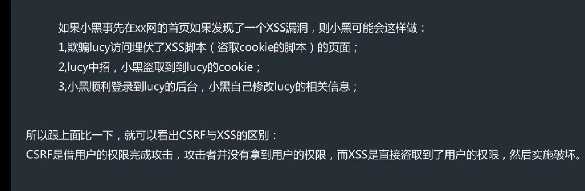

## CSRF

csrf与xss的区别在于：xss是盗取用户cookie值然后登录网页进行破坏，攻击者算是盗取到了用户的权限；csrf是借用用户的权限进行攻击，攻击者没有盗取到用户的权限。

防止csrf攻击：

可以设置token值；

还有就是在登录重要网站时不能随便点击别人发的链接；

在密码登录的时候加上验证码；

还有敏感信息修改时需要加上二次验证；

## SSRF（服务器端请求伪造）

攻击流程：攻击者----服务器------目标地址

攻击者将要获取信息的网址传入服务器，服务器对目标网址发起请求然后返回数据

原因：没对服务端访问的其他目标站点做过滤与限制

对目标站点做好过滤，或者指定目标站点

## REC

分为远程代码执行和远程系统命令执行

防止方法有执行严格的白名单

## 文件包含漏洞

本地文件包含

在url栏中写入本地含有的php可执行命令

未对传进来的变量做处理，直接包含了。

我们可以制定严格的白名单指定文件名

远程文件包含

在远程服务器上写入可执行php文件，比如一句话木马，然后将文件所在网址

复制到要攻击的网站url栏可执行远程文件包含漏洞的地方

不能把文件包含函数对应的文件放在前端选择和操作

过滤../../这些与本地文件包含漏洞有关的命令

白名单仅包含指定运行的文件

配置网站php.ini文件，都关闭掉，像：allow_url_fopen=off   ；  allow_url_include=off 这些

## 不安全的文件下载

原理是没对前端传进来的文件进行判断，没判断是否在下载范围内，直接读取导致内部文件信息的泄露

对传入文件名进行过滤

对文件下载目录进行限定

## 文件上传

原理：在文件上传的地方，服务端脚本语言没对文件类型进行严格的验证和过滤，导致攻击者上传了恶意脚本文件时，从而得到服务端命令执行的能力。

mime型验证：先上传一句话.php，点击上传，然后用bp抓包，再修改content-Type里的内容为image/jpg

最后放包，然后用蚁剑连接

前端限制：打开源代码控制台，删除相关限制函数，再进行上传

getimagesize型验证：在CMD命令中输入:copy /b 1.jpg + yijuhua.php 2.jpg

来生成2.jpg这个包含一句话木马的图片，然后上传，再利用本地文件包含漏洞进行利用

## 越权漏洞

平行越权：a与b权限同级，B越权操作A个人信息的行为叫平行越权

B登录上去后，在URL栏将信息改成A的然后进行访问，即可查询到A的个人信息

垂直越权：A权限高于B，B越权操作A个人信息的行为叫垂直越权

抓取管理员A的数据包，得到A操作的cookie值，然后在B登录后抓取包替换上A的cookie值然后放包，就可以复现管理员A的行为

垂直越权限制太大，运用场景少

越权漏洞属于逻辑漏洞，是权限校验不严谨导致的

## XXE漏洞

原理：某些应用程序在解析xml文件时，没对上传的xml文件进行过滤处理，导致上传的xml文件可能包含某些命令可以加载恶意外部实体文件。

可以利用这个漏洞读取本地文件、php文件、内部开放端口这些，还有就是ddos攻击

## 当你是蓝队领班，此时网站被getshell后你该怎么处理？

应急响应

## 了解内网渗透和面杀吗？

# 中间件漏洞

## 	IIS

PUT漏洞

短文件名猜解

远程代码执行：在IIS6.0处理PROPFIND指令的时候，由于对url的长度没有进行控制和检查，导致执行memcpy对虚拟路径进行构造的时候，引发栈溢出，从而导致远程代码执行。

解析漏洞：对含有特殊字符的路径进行处理时会出现逻辑错误，从而造成解析漏洞。（上传名为 "test.asp;.jpg" 的文件，虽然该文件真正的后缀名是 ".jpg", 但由于含有特殊符号 ";" ，仍会被 IIS 当做 asp 程序执行。）

## apache

解析漏洞：有些用户的配置有问题

目录遍历：也是配置有错导致的

## Nginx

文件解析：当文件配置中security.limit_extensions = .php这一选项没有，则可以在网站根目录里建一个shell.jpg文件，在里面写入phpinfo()，然后打开，然后利用文件解析漏洞，输入url后面跟上shell.jpg/2.php，网站就会执行之前写入的命令

目录遍历：也是配置上的问题

CRLF注入

## tomcat

远程代码执行：要求tomcat运行在Windows上，并且启用了HTTP put请求方法，可以通过构造的攻击命令向服务器上传任意代码的jsp文件，造成任意代码执行。

war后门文件部署

## jboss

反序列化：在序列化和反序列化的过程中，过滤不严格，可能会导致恶意构造的代码出现。（访问url/invoker/readonly，返回500，说明页面存在，此页面有反序列化漏洞）

war后门文件部署：如果jBoss后台管理页面存在弱口令，可以通过爆破获得账号密码。登陆后台上传包含后门的war包

## weblogic

反序列化

任意文件上传

war后门文件部署：如果后台管理页面存在弱口令，可以通过爆破获得账号密码。登陆后台上传包含后门的war包

## 菜刀、冰蝎、蚁剑、哥斯拉的流量特征

### 菜刀（cknife)

现在是base64流量加密，流量大，可用base64解码

### 蚁剑

只了解php是通过base64流量加密

可以对蚁剑的正文内容进行URL解码，流量最中明显的特征为@ini_set("display_errors","0");这段代码是明文的。

蚁剑混淆加密后还有一个比较明显的特征，就是参数名大多以“_0x.....=”这种形式，所以，以_0x开头的参数名，后面为加密数据的数据包也可识别为蚁剑的流量特征

### 冰蝎

通过AES对称加密

冰蝎数据包总是伴随着大量的content-type：application什么什么，无论GET还是POST，请求的http中，content-type为application/octet-stream；

content-length 请求长度，对于密钥交互，获取基本信息来讲，payload都为固定长度，所以我们可以看多个数据包中payload是不是固定长度就行

### 哥斯拉

base64加密

